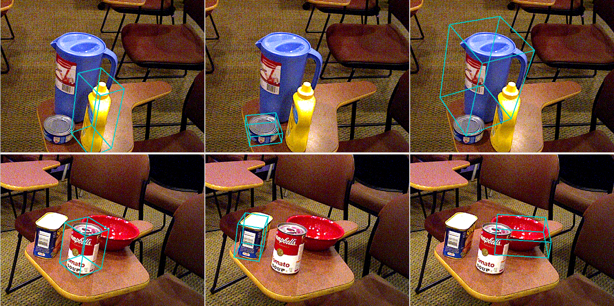

# ObjectPoseEstimation

Methods for zero-shot 6D object pose estimation from RGB(-D) images:
* [ZS6D](https://github.com/PhilippAuss/ZS6D)
* [SAM-6D](https://github.com/JiehongLin/SAM-6D)
* [FoundPose](https://github.com/facebookresearch/foundpose)

Evaluation on the [BOP datasets](https://bop.felk.cvut.cz/datasets/).

## Requirements
2025/05/20 - Tested with:
*    11th Gen Intel(R) Core(TM) i7-11800H @ 2.30GHz - 1 socket, 8 cores per socket, 2 threads per core
*    32GiB RAM - 2 x 16GiB SODIMM DDR4 Synchronous 3200 MHz
*    NVIDIA GeForce RTX 3080 Mobile 16GB
*    [Ubuntu](https://ubuntu.com/) 22.04.5
*    [NVIDIA Driver](https://documentation.ubuntu.com/server/how-to/graphics/install-nvidia-drivers/index.html) Version: 535.247.01
*    [Docker](https://docs.docker.com/engine/install/ubuntu/) version 28.1.1, build 4eba377
*    [NVIDIA Container Toolkit](https://docs.nvidia.com/datacenter/cloud-native/container-toolkit/latest/install-guide.html) 1.17.6
*    [OSRF/rocker](https://github.com/osrf/rocker) 0.2.19

## Installation
Clone the repository:
```
git clone https://github.com/RoboticRepositories/ObjectPoseEstimation.git
cd ObjectPoseEstimation && git submodule update --init --recursive
```

## Datasets
```
./Datasets/bop/detections/download.sh
```
```
./Datasets/bop/lmo/download.sh
```
```
./Datasets/bop/ycbv/download.sh
```

## [ZS6D](https://github.com/PhilippAuss/ZS6D)

Build the Docker image:
```
./Docker/ZS6D/build.sh
```

Or pull it from Docker hub:
```
./Docker/ZS6D/pull.sh
```

Run a Docker container:
```
./Docker/ZS6D/run.sh 
```

Jupyter is running in the Docker container:
1. [Download templates for YCBV](http://localhost:8888/notebooks/download_templates.ipynb)
2. [Prepare the templates](http://localhost:8888/notebooks/prepare_templates_and_gt.ipynb)
3. [Run an inference test](http://localhost:8888/notebooks/inference_test.ipynb)



## [SAM-6D](https://github.com/JiehongLin/SAM-6D)

Build the Docker image:
```
./Docker/SAM-6D/build.sh
```

Or pull it from Docker hub:
```
./Docker/SAM-6D/pull.sh
```

Run a Docker container:
```
./Docker/SAM-6D/run.sh 
```

Jupyter is running in the Docker container:
1. [Download models](http://127.0.0.1:8888/notebooks/download_models.ipynb)
2. [Render templates](http://127.0.0.1:8888/notebooks/render_templates.ipynb)
3. [Run an inference test](http://localhost:8888/notebooks/inference_demo.ipynb)

## [FoundPose](https://github.com/facebookresearch/foundpose)

Build the Docker image:
```
./Docker/FoundPose/build.sh
```

Or pull it from Docker hub:
```
./Docker/FoundPose/pull.sh
```

Run a Docker container:
```
./Docker/FoundPose/run.sh 
```

Jupyter is running in the Docker container:
1. [Download](http://localhost:8888/notebooks/download_templates.ipynb) templates for LM-O
2. [Generate](http://localhost:8888/notebooks/gen_repre.ipynb) object representations for LM-O
3. [Run an inference test](http://localhost:8888/notebooks/infer.ipynb)
